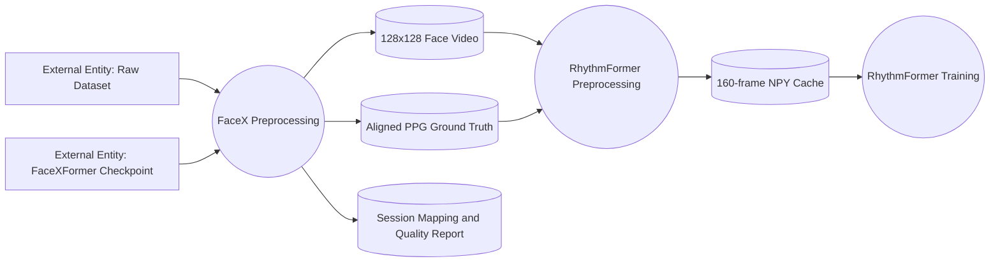
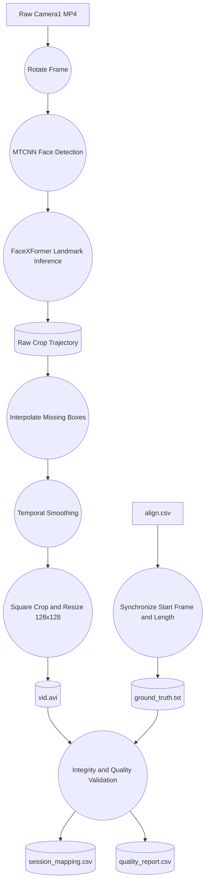

# FaceXFormer preprocessing for RhythmFormer

## Status

The Mac implementation and non-CUDA tests were completed on 2026-07-28. The
server disk, CUDA environment, checkpoint, and rotated official-inference smoke
test were verified on 2026-07-28. Attempt 3 and its postflight checks completed
successfully on 2026-07-31: 618 mapping rows, 607 validated outputs, 11 skipped,
0 failed, and postflight exit code 0. The detailed final audit is in
`../docs/preprocessing_status_2026-08-01.md`.

## Motivation

The previous converter center-cropped every rotated frame. That can cut off the
face, include a large and changing background region, or move skin pixels even
when the face itself moves only slightly. These effects are especially harmful
to remote photoplethysmography because the desired color variation is small
relative to motion and compression artifacts.

This pipeline first detects a face with MTCNN and then uses FaceXFormer facial
landmarks to define the crop. Landmarks follow the facial geometry more closely
than a fixed image-center assumption. Interpolation prevents isolated detection
failures from deleting frames, while median and Savitzky-Golay filtering remove
jitter from the crop trajectory. The crop is always taken from the original
rotated frame; the detector/landmark image is not re-encoded into the output.

FaceXFormer's 68 landmarks do not include the top of the forehead. The square
is therefore enlarged to 1.6 times the landmark span and its center is shifted
upward by 0.08 times the square side. This is a pragmatic forehead inclusion
rule, not a forehead landmark estimate.

## Data flow





## Repositories and fixed versions

- rPPG-Data source:
  `https://github.com/nordlinglab/remote-physiological-signal-data-preprocessing.git`
- rPPG-Data branch: `feature/facexformer-preprocess`
- rPPG-Data implementation base: `23d846506d17911b61eb86c1a480c06ac124e0d6`
- Preserved rPPG-Data implementation commit:
  `fa117605e302da947f11cbebec5f594f560f402d`
- RhythmFormer source: `https://github.com/Chengsson/Rhythmformer_xai.git`
- RhythmFormer branch: `feature/facexformer-preprocess`
- RhythmFormer implementation base: `4bec571e03868bb791d7f6d8e54f024f35951674`
- RhythmFormer FaceX128 config commit:
  `ab063be0bf119e28c4ea724fdd3916873f16ca8a`
- Official FaceXFormer: `https://github.com/Kartik-3004/facexformer.git`
- FaceXFormer commit: `10fe8291f8a64e2ca1daf938e3e0007bd860303b`
- FaceXFormer checkpoint: Hugging Face
  `kartiknarayan/facexformer`, file `ckpts/model.pt`
- FaceXFormer checkpoint SHA-256:
  `327a755849ba64d336fb96589ff87b27e84a12be1ecf8bcfaa503d66f803286d`
- RhythmFormer config:
  `configs/5OurDataset_FaceX128_RHYTHMFORMER.yaml`

The FaceXFormer repository remains unmodified. The converter temporarily
constructs the official Swin-B architecture without downloading redundant
ImageNet weights, then loads every parameter from the official FaceXFormer
checkpoint.

## Input and output

The Mac raw data used for discovery validation is:

```text
/Volumes/Adata/Non-contact Video Archive/Video/
├── 11/
│   ├── 11_rotate_20230921_020514_camera1.MP4
│   └── 11_rotate_20230921_020514_extended_poll.bin_align.csv
└── ...
```

Only non-AppleDouble camera1 MP4 files are considered. Every MP4 must have
exactly one matching `*_align.csv`.

The final UBFC-compatible output is:

```text
OurDataset_RhythmFormer_FaceX_128/
├── subject001/
│   ├── vid.avi
│   ├── ground_truth.txt
│   └── .facex_quality.json
├── session_mapping.csv
├── quality_report.csv
├── session_mapping_shard_00.csv
└── quality_report_shard_00.csv
```

The hidden per-session quality JSON preserves detection metrics across resume.
RhythmFormer ignores it.

## Synchronization, geometry, and smoothing

For each video:

1. Read `start_frame` from column 0 of the first `align.csv` row.
2. Read PPG from column 2, beginning at row 0.
3. Stop at the first non-numeric PPG row.
4. Use
   `min(video_frame_count - start_frame, numeric_PPG_row_count)` frames.
5. Do not use `data choose.csv`, `clean_intervals.csv`, or any filtered CSV.

The crop trajectory for 68 landmark points is:

```text
landmark_width  = max(x) - min(x)
landmark_height = max(y) - min(y)
side            = 1.6 * max(landmark_width, landmark_height)
center_x        = (min(x) + max(x)) / 2
center_y        = (min(y) + max(y)) / 2 - 0.08 * side
```

Missing `[center_x, center_y, side]` samples are linearly interpolated.
Leading/trailing gaps use the nearest valid box. The default temporal filters
are a 5-frame median filter followed by an 11-frame, second-order
Savitzky-Golay filter. Short sessions automatically use the largest valid odd
window.

Subjects `984`, `660`, `301`, `717`, and `764` rotate 90 degrees
counter-clockwise. All other subjects rotate 90 degrees clockwise. Crops are
shifted inside the rotated frame without changing their square shape, resized
to 128 by 128, and encoded at the source FPS.

## Failure, resume, and atomicity

- Newly processed or resumed sessions below `--min-detection-rate` fail the
  shard after its manifest row is written. The default threshold is 0.80.
- Missing/empty/ambiguous alignment files receive stable session IDs and are
  recorded as `skipped`.
- Repeatable `--skip-session SESSION=REASON` operator exclusions preserve the
  discovered session ID and mapping, write the supplied reason as `skipped`,
  do not initialize the detector when no runnable session remains, and never
  create a formal session output directory. Unknown or malformed IDs fail
  before detector initialization.
- Isolated missing detections are interpolated and counted.
- Each session is first written to `.subjectNNN.tmp.PID`, then atomically
  renamed.
- `--resume` validates that AVI and GT exist, the AVI is decodable, dimensions
  are 128 by 128, FPS is correct, and decoded/reported/GT counts agree.
- Invalid partial output is removed and regenerated.
- Every shard owns session IDs by
  `(numeric_session_id - 1) % num_shards`, so processes never write the same
  session.
- The minimum per-channel temporal RGB correlation between the pre-encode
  resized crops and decoded AVI is 0.99. A lower result deletes that session,
  stops the launcher, and requires a higher-quality codec before the full run.
- Any preprocessing exception writes the failed row and current shard mapping,
  then exits that shard immediately. The launcher terminates the other shards
  and does not merge or validate a failed attempt.

## Mac development record

Existing dirty worktrees were not modified. Clean worktrees were created at:

```text
/Volumes/Adata/facexformer_preprocess_worktrees/rPPG-Data
/Volumes/Adata/facexformer_preprocess_worktrees/RhythmFormer
```

The isolated non-CUDA test environment was:

```text
macOS 26.5 (25F71), arm64
Python 3.11.13
NumPy 1.26.4
OpenCV 4.11.0
SciPy 1.17.1
pandas 3.0.5
PyYAML 6.0.3
```

Commands that were run successfully:

```bash
cd /Volumes/Adata/facexformer_preprocess_worktrees/rPPG-Data
/Volumes/Adata/facexformer_preprocess_test_env/bin/python \
  -m unittest discover -s preprocessing/tests -v

/Volumes/Adata/facexformer_preprocess_test_env/bin/python \
  -m py_compile \
  Preprocessing_data/facexformer_preprocess.py \
  Preprocessing_data/launch_facexformer_4gpu.py

cd /Volumes/Adata/facexformer_preprocess_worktrees/RhythmFormer
/Volumes/Adata/facexformer_preprocess_test_env/bin/python - <<'PY'
from pathlib import Path
import yaml

path = Path("configs/5OurDataset_FaceX128_RHYTHMFORMER.yaml")
config = yaml.safe_load(path.read_text())
for split in ("TRAIN", "VALID", "TEST"):
    preprocess = config[split]["DATA"]["PREPROCESS"]
    assert preprocess["CROP_FACE"]["DO_CROP_FACE"] is False
    assert preprocess["RESIZE"] == {"H": 128, "W": 128}
    assert preprocess["CHUNK_LENGTH"] == 160
print("config validation passed")
PY
```

The original Mac discovery pass found 618 camera1 videos. Alignment recovery on
the server reduced the final missing-alignment count to nine; two additional
sessions were explicit quality/source-video exclusions. The final output has
607 validated sessions and 11 skipped sessions.

## Server target layout

The external disk is mounted and linked into this deployment layout:

```text
/home/nordlinglab/Louis/facex_preprocess/
├── rPPG-Data/
├── RhythmFormer/
├── facexformer/
└── data -> /mnt/adata
```

`findmnt` reports `/dev/sdb2`, exFAT, mounted at `/mnt/adata`, with a 1.8 TiB
filesystem and 308.3 GiB available. `df -BG` reports 309 GB available. The
mount is writable by `nordlinglab`.

## Server environment and clone commands

The deployed repositories use these clone commands:

```bash
mkdir -p /home/nordlinglab/Louis/facex_preprocess
cd /home/nordlinglab/Louis/facex_preprocess

git clone --branch feature/facexformer-preprocess --single-branch \
  https://github.com/nordlinglab/remote-physiological-signal-data-preprocessing.git \
  rPPG-Data
git clone --branch feature/facexformer-preprocess --single-branch \
  https://github.com/Chengsson/Rhythmformer_xai.git RhythmFormer
git clone https://github.com/Kartik-3004/facexformer.git facexformer
git -C facexformer checkout 10fe8291f8a64e2ca1daf938e3e0007bd860303b

PYTHONNOUSERSITE=1 conda env create \
  --file preprocessing/environment.yml
conda activate facexformer-preprocess
export PYTHONNOUSERSITE=1

python - <<'PY'
from huggingface_hub import hf_hub_download
hf_hub_download(
    repo_id="kartiknarayan/facexformer",
    filename="ckpts/model.pt",
    local_dir="/home/nordlinglab/Louis/facex_preprocess/facexformer",
)
PY
```

The target environment is Python 3.10, PyTorch 2.2.2 with CUDA 12.1,
torchvision 0.17.2, facenet-pytorch 2.6.0, Pillow 10.2, NumPy 1.26, OpenCV,
SciPy, pandas, fsspec, tqdm, and huggingface_hub. The conda environment also
sets `PYTHONNOUSERSITE=1` so packages under `~/.local` cannot contaminate the
run.

## Server preflight record

Verified on 2026-07-28:

- Linux kernel `6.8.0-136-generic`.
- NVIDIA driver `595.84`; the previous NVML mismatch is resolved.
- Four NVIDIA RTX A5000 GPUs, 24564 MiB each.
- No existing NVIDIA compute processes.
- PyTorch allocated a CUDA tensor successfully on devices 0, 1, 2, and 3.
- Python 3.10.20, PyTorch 2.2.2+cu121, torchvision 0.17.2+cu121,
  OpenCV 4.10.0, NumPy 1.26.4, pandas 2.3.3, SciPy 1.15.2,
  fsspec 2026.6.0, and tqdm 4.70.0.
- `python -m pip check` reported no broken requirements.
- The server rPPG-Data and RhythmFormer clones were clean at
  `397522ec812b3a8da8bec72ea34c7040ecf52421` and
  `ab063be0bf119e28c4ea724fdd3916873f16ca8a`, respectively.

## CUDA and official single-image smoke test

After the external input root is linked as
`/home/nordlinglab/Louis/facex_preprocess/data`, the official smoke test is:

```bash
cd /home/nordlinglab/Louis/facex_preprocess
conda activate facexformer-preprocess
export PYTHONNOUSERSITE=1

python - <<'PY'
import cv2
import torch
from pathlib import Path

source = (
    "data/Non-contact Video Archive/Video/11/"
    "11_rotate_20230921_020514_camera1.MP4"
)
capture = cv2.VideoCapture(source)
ok, frame = capture.read()
capture.release()
assert ok
frame = cv2.rotate(frame, cv2.ROTATE_90_CLOCKWISE)
results = Path("facexformer/smoke_results_rotated")
results.mkdir(parents=True, exist_ok=True)
cv2.imwrite("facexformer/smoke_frame_rotated.png", frame)
print(torch.cuda.get_device_name(0))
print(torch.__version__, torch.version.cuda)
PY

python facexformer/inference.py \
  --model_path facexformer/ckpts/model.pt \
  --image_path facexformer/smoke_frame_rotated.png \
  --results_path facexformer/smoke_results_rotated \
  --task landmarks \
  --gpu_num 0

test -s facexformer/smoke_results_rotated/landmarks.txt
test "$(wc -l < facexformer/smoke_results_rotated/landmarks.txt)" -eq 68
```

This rotated smoke test passed on 2026-07-28 and produced exactly 68 landmark
rows.

## 100-frame pilot

```bash
cd /home/nordlinglab/Louis/facex_preprocess
conda activate facexformer-preprocess

python preprocessing/facexformer_preprocess.py run \
  --input-root "data/Non-contact Video Archive/Video" \
  --output-dir data/pilot_100_frames \
  --facexformer-root facexformer \
  --checkpoint facexformer/ckpts/model.pt \
  --device cuda:0 \
  --batch-size 16 \
  --subject 11 \
  --activity rotate \
  --max-frames 100

python preprocessing/facexformer_preprocess.py merge \
  --output-dir data/pilot_100_frames \
  --num-shards 1
python preprocessing/facexformer_preprocess.py validate \
  --output-dir data/pilot_100_frames
```

Do not proceed if `quality_report.csv` reports a failed session or temporal RGB
correlation below 0.99.

## Subject 11 rotate full-video test

```bash
cd /home/nordlinglab/Louis/facex_preprocess
conda activate facexformer-preprocess

python preprocessing/facexformer_preprocess.py run \
  --input-root "data/Non-contact Video Archive/Video" \
  --output-dir data/pilot_subject11_rotate_full \
  --facexformer-root facexformer \
  --checkpoint facexformer/ckpts/model.pt \
  --device cuda:0 \
  --batch-size 16 \
  --subject 11 \
  --activity rotate

python preprocessing/facexformer_preprocess.py merge \
  --output-dir data/pilot_subject11_rotate_full \
  --num-shards 1
python preprocessing/facexformer_preprocess.py validate \
  --output-dir data/pilot_subject11_rotate_full
```

## Four-GPU preprocessing

Run only after both pilots pass:

```bash
cd /home/nordlinglab/Louis/facex_preprocess
conda activate facexformer-preprocess

python preprocessing/launch_facexformer_4gpu.py \
  --input-root "data/Non-contact Video Archive/Video" \
  --output-dir data/OurDataset_RhythmFormer_FaceX_128 \
  --facexformer-root facexformer \
  --checkpoint facexformer/ckpts/model.pt \
  --gpus 0,1,2,3 \
  --batch-size 16 \
  --codec FFV1 \
  --min-rgb-correlation 0.99 \
  --min-detection-rate 0.80 \
  --skip-session \
    "subject381=operator exclusion: detection 0.5995 below 0.80" \
  --skip-session \
    "subject402=operator exclusion: corrupt H.264; 7552/7560 decodable"
```

The launcher monitors all processes and stops the other shards immediately if
one exits nonzero. SIGINT and SIGTERM terminate children, wait up to 10 seconds,
kill any remaining processes, reap them, and close their logs. It merges shard
manifests and runs integrity validation only after all four shards exit zero.
The equivalent explicit final commands are:

```bash
python preprocessing/facexformer_preprocess.py merge \
  --output-dir data/OurDataset_RhythmFormer_FaceX_128 \
  --num-shards 4
python preprocessing/facexformer_preprocess.py validate \
  --output-dir data/OurDataset_RhythmFormer_FaceX_128
```

## Quality summary command

```bash
cd /home/nordlinglab/Louis/facex_preprocess
conda activate facexformer-preprocess

python - <<'PY'
from pathlib import Path
import pandas as pd

root = Path("data/OurDataset_RhythmFormer_FaceX_128")
report = pd.read_csv(root / "quality_report.csv")
success = report[report.status.isin(["success", "resumed"])]
print("sessions", len(report))
print(report.status.value_counts(dropna=False).to_dict())
print("frames", int(success.total_frames.sum()))
print("detection_rate", success.detected_frames.sum() / success.total_frames.sum())
print("interpolation_rate", success.interpolated_frames.sum() / success.total_frames.sum())
print("elapsed_seconds_sum", success.elapsed_seconds.sum())
print("aggregate_processing_fps", success.total_frames.sum() / success.elapsed_seconds.sum())
print("output_bytes", sum(p.stat().st_size for p in root.rglob("*") if p.is_file()))
PY
```

The final execution record, skipped-session reasons, and subject-798 metrics are
preserved in `../docs/preprocessing_status_2026-08-01.md`.

## RhythmFormer preprocess-only validation

The config keeps standardization, 128 by 128 resizing, and 160-frame chunks,
but disables face cropping for TRAIN, VALID, and TEST:

```bash
cd /home/nordlinglab/Louis/facex_preprocess/RhythmFormer
conda activate facexformer-preprocess

python main.py \
  --config_file \
  configs/5OurDataset_FaceX128_RHYTHMFORMER.yaml \
  --preprocess_only
```

The expected cache base is
`/home/nordlinglab/Louis/facex_preprocess/PreprocessedData/OurDataset_FaceX128/`.
RhythmFormer preprocess-only is deliberately blocked for this run: its current
float64 cache is estimated at approximately 2.39 TiB, which exceeds the 309 GB
available on `/mnt/adata`. It must not be started until the cache representation
or storage plan changes.

## Resume and rerun

The default is `--resume`. Re-run the same shard or the four-GPU launcher after
an interruption; validated sessions are skipped and their saved quality
metrics are retained. To deliberately regenerate selected output, use
`--no-resume` with `run`. Do not delete or renumber shard manifests while
processes are active.

If the codec changes, write to a new output directory first. Compare its
temporal RGB correlation and size before replacing the production path.

### Attempt-1 through attempt-3 recovery record

Attempt 1 retained 436 complete session directories and stopped when
`subject402` raised `Source decoded 109/6256 aligned frames`. Independent
source-video decoding found 7552 decodable frames out of 7560. The original
H.264 MP4 is retained unchanged; no repaired transcode is created.

The user approved exactly two operator exclusions:

- `subject381`: detection rate 0.5994749278 (11417/19045), below the 0.80 gate.
- `subject402`: corrupt H.264 source, 7552/7560 frames decodable.

Before attempt 2, the attempt-1 launcher, shard, progress, GPU, disk, and ntfy
artifacts were archived under `attempt_01_failed/`. The complete `subject381`
output was quarantined under
`_quarantine/subject381_detection_0.5995_attempt01/`. Attempt 3 recovered ten
alignment sessions. Final accounting is 618 total sessions, 607 validated
outputs, 11 skipped (nine missing alignments and the two approved operator
exclusions), and 0 failed.

## Troubleshooting

- `Failed to initialize NVML: Driver/library version mismatch`: the server was
  repaired and verified with driver 595.84 on 2026-07-28. If it recurs, stop;
  `torch.cuda.is_available()` plus all four device names must pass before
  preprocessing.
- CUDA out of memory: reduce `--batch-size` from 16 to 8 or 4. MTCNN is still
  evaluated per frame and is the main fixed per-frame cost.
- No face for an entire video: inspect rotation and several source frames. The
  session remains `skipped`; isolated misses should be interpolated.
- Missing align: repair the raw recording metadata, not the generated
  manifests. Stable session IDs intentionally retain gaps.
- AVI cannot be decoded: verify OpenCV codec support with
  `cv2.getBuildInformation()`.
- RGB correlation below 0.99: stop the full run and test a higher-quality AVI
  codec on the 100-frame and subject 11 pilots.
- RhythmFormer crops again: confirm `DO_CROP_FACE: False` in all three config
  splits and that the FaceX128 config, not the legacy config, was supplied.

## Known limitations

- MTCNN is run on every frame and can dominate runtime.
- The final output uses lossless FFV1; the 0.99 temporal RGB correlation gate
  remains an end-to-end integrity check.
- The 68-point topology has no forehead-top landmark; the upward enlargement
  rule is an approximation.
- The attempt-03 disk watchdog warns below 80 GB free and stops the launcher
  below 50 GB free.
